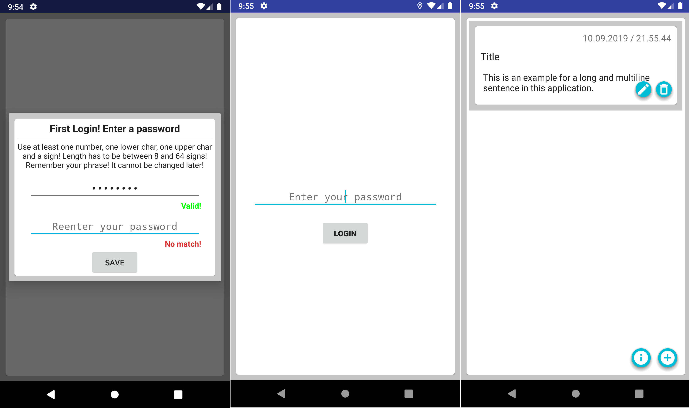
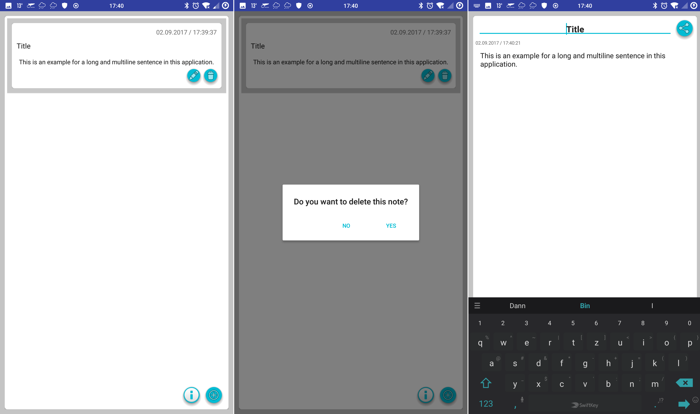

# MyNoteEncrypted - develop branch

[](https://www.android.com)
<a target="_blank" href="https://android-arsenal.com/api?level=21" title="API21+"></a>
[](https://opensource.org/licenses/MIT)
<a target="_blank" href="https://www.paypal.me/GuepardoApps" title="Donate using PayPal"></a>

[](release)
[](release/v1.0.0.170902.apk)

Android application for creating notes and saving them to an encrypted database using the library sqlcipher.

## Screenshots


___________________________________



## SQL Cipher integration

add following line to your dependencies

```java
    compile 'net.zetetic:android-database-sqlcipher:3.5.1@aar'
```

replace following snippets in your database class

```java
import android.database.Cursor;
import android.database.SQLException;
import android.database.sqlite.SQLiteDatabase;
import android.database.sqlite.SQLiteOpenHelper;
```

with following snippets

```java
import net.sqlcipher.Cursor;
import net.sqlcipher.SQLException;
import net.sqlcipher.database.SQLiteDatabase;
import net.sqlcipher.database.SQLiteOpenHelper;
```

to use your database open it with following method providing a passphrase for encryption and decryption

```java

// More code above

public Database Open(@NonNull String passphrase) throws SQLException {
	_databaseHelper = new DatabaseHelper(_context);
	_database = _databaseHelper.getWritableDatabase(passphrase);
	return this;
}

// More code below

```

### Important

Above is only possible if you load the libs. the earlier in your application the better.
I use a class DatabaseController to handle  all action for the database and I call the necessary method in an initalize method

```java

// More code above

public boolean Initialize(@NonNull Context context, @NonNull String passphrase) {
	if (_initialized) {
		return false;
	}

	_context = context;
	SQLiteDatabase.loadLibs(_context);		// This is the important line!
	_database = new Database(_context);

	try {
		_database.Open(passphrase);			// Try and catch also checks if the passphrase is valid!
	} catch (SQLException sqlException) {
		return false;
	}

	_initialized = true;

	return true;
}

// More code below

```

### Caution

Currently it is not possible to change the passphrase once it is set! You have to reset the applications data, but all notes will be lost!
Also you have only FIVE tries to login. Otherwise everything will be deleted!

# Troubleshooting

I tried to test this application using the android studio emulator on Windows 10. This is due to x86 not working...
Use your android smartphone!

Further helpful links:

- https://discuss.zetetic.net/t/sqlcipher-integration-problem/1487
- https://stackoverflow.com/questions/40674016/android-app-crashes-with-unsatisfiedlinkerror-when-using-sqlcipher-and-crashlyti

## License

MyNoteEncrypted is distributed under the MIT license. [See LICENSE](LICENSE.md) for details.