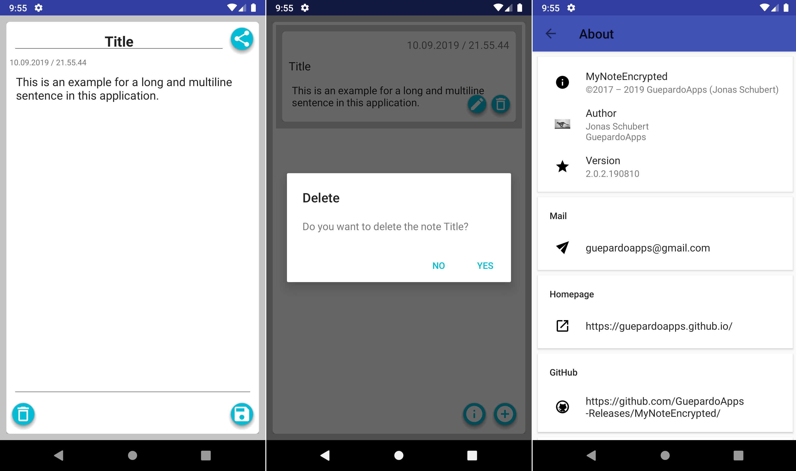

# MyNoteEncrypted

[](https://play.google.com/store/apps/details?id=guepardoapps.mynoteencrypted)
[](https://www.paypal.me/GuepardoApps)

[](./releases)
[](./releases)
[](https://android-arsenal.com/api?level=26)

[](https://www.android.com)
[](https://opensource.org/licenses/MIT)
[](http://makeapullrequest.com)

Android application for creating notes and saving them to an encrypted database using the library sqlcipher.

## Screenshots


___________________________________



## SQL Cipher integration

add following line to your dependencies

```kotlin
    implementation 'net.zetetic:android-database-sqlcipher:3.5.1@aar'
```

replace following snippets in your database class

```kotlin
import android.database.SQLiteDatabase
import android.database.SQLiteOpenHelper
```

with following snippets

```kotlin
import net.sqlcipher.database.SQLiteDatabase
import net.sqlcipher.database.SQLiteOpenHelper
```

## Important

Above is only possible if you load the libs. the earlier in your application the better.
I use a class DatabaseController to handle  all action for the database and I call the necessary method in an initalize method

```kotlin

// More code above

fun initialize(context: Context, passphrase: String): Boolean {
       if (initialized) {
           return false
       }

       SQLiteDatabase.loadLibs(context)

       try {
           dbNote = DbNote(context, passphrase)
       } catch (sqlException: SQLException) {
           return false
       }

       return true
   }

// More code below

```

## Caution

Currently it is not possible to change the passphrase once it is set! You have to reset the applications data, but all notes will be lost!
Also you have only FIVE tries to login. Otherwise everything will be deleted!

## Troubleshooting

I tried to test this application using the android studio emulator on Windows 10. This is due to x86 not working...
Use your android smartphone!

Further helpful links:

- https://discuss.zetetic.net/t/sqlcipher-integration-problem/1487
- https://stackoverflow.com/questions/40674016/android-app-crashes-with-unsatisfiedlinkerror-when-using-sqlcipher-and-crashlyti

## License

MyNoteEncrypted is distributed under the MIT license. [See LICENSE](LICENSE.md) for details.

```
MIT License

Copyright (c) 2017 - 2019 GuepardoApps (Jonas Schubert)

Permission is hereby granted, free of charge, to any person obtaining a copy
of this software and associated documentation files (the "Software"), to deal
in the Software without restriction, including without limitation the rights
to use, copy, modify, merge, publish, distribute, sublicense, and/or sell
copies of the Software, and to permit persons to whom the Software is
furnished to do so, subject to the following conditions:

The above copyright notice and this permission notice shall be included in all
copies or substantial portions of the Software.

THE SOFTWARE IS PROVIDED "AS IS", WITHOUT WARRANTY OF ANY KIND, EXPRESS OR
IMPLIED, INCLUDING BUT NOT LIMITED TO THE WARRANTIES OF MERCHANTABILITY,
FITNESS FOR A PARTICULAR PURPOSE AND NONINFRINGEMENT. IN NO EVENT SHALL THE
AUTHORS OR COPYRIGHT HOLDERS BE LIABLE FOR ANY CLAIM, DAMAGES OR OTHER
LIABILITY, WHETHER IN AN ACTION OF CONTRACT, TORT OR OTHERWISE, ARISING FROM,
OUT OF OR IN CONNECTION WITH THE SOFTWARE OR THE USE OR OTHER DEALINGS IN THE
SOFTWARE.
```
